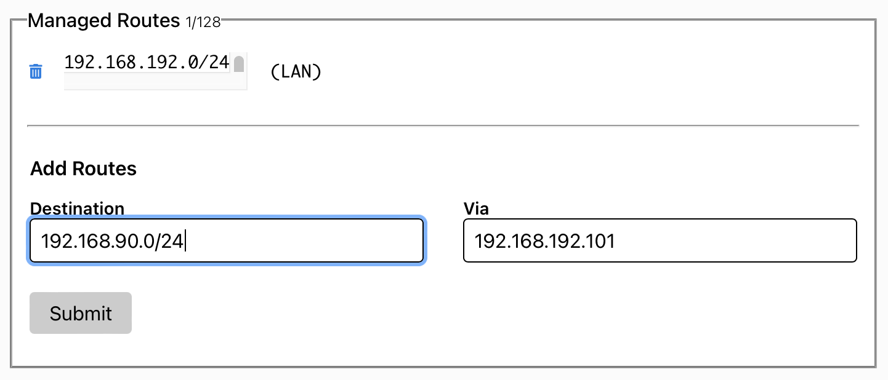

# Poradnik połączenia clustra z siecią ZeroTier (VPN)
W poradniku przedstawię sposób połączenia udostępnionego clustra z siecią ZeroTier. Umożliwi to dostęp zdalny do clustra bez konieczności otwierania czy przekierowania portów w routerach.

## Uwagi ogólne
1. Poniższy opis sporządzono przy założeniu, że ZeroTier będzie zainstalowane na jednej z malinek naszego clustra. W takiej konfiguracji przynajmniej ta malinka powinna cały czas pracować. Pozostałe malinki mogą być wyłączane na czas sensownie długich przerw w pracy - dla oszczędzania malinek jako takich oraz - jeśli malinki mają na stałe włączone wentylatory - dla obniżenia poziomu szumu w pomieszczeniu (słychać je, zwłaszcza w nocy). Sposób zdalnego włączenia klastra podano w następnym punkcie Uwag ogólnych. Gdyby jednak instalację ZeroTier chcieć przeprowadzić na odrębnej "maszynie" (nie malince) pracującej w tej samej podsieci co nasz cluster, wtedy wystarczy "zamienić" słowo raspberka na "maszyna" i instrukcja w 100% stosuje się do tego przypadku. W takim przypadku wyłączyć można wszystkie malinki. Wyłączenie malinek można robić ręcznie wchodząc na każdą przez ssh lub skorzystać ze skryptu shutubu.sh dostępnego na głównym folderze niniejszego repo.

#### UWAGA: skrypt shutubu.sh korzysta z ansible w trybie ad-hoc, a ten obecnie bazuje na pliku inventory/main.yaml. Plik ten obejmuje wszystkie malinki klastra - wszystkie są wyłączane tym skryptem.

**W przypadku zainstalowania ZeroTier na malince, do wyłączania klastra należy sporządzić odrębny plik inventory - bez raspberki hostującej ZeroTier (jej przecież nie należy wyłączać, bo musi obsługiwać VPN podczas zdalnego rebootowania TP-Link)**. Jeśli nie przewidujemy zdalnego włączania klastra przez rebootowanie TP-Link, wówczas wyłączać można wszystkie węzły klastra - z wykorzystaniem pliku inventory/main.yaml.

2. Zdalne włączenie klastra jest możliwe poprzez reboot klastrowego swicha TP-Link. Podczas rebootu odłącza on i ponownie podaje zasilanie na porty PoE, co powoduje twarde włączenie płyt Raspberry Pi. Przez przeglądarkę wchodzimy na pulpit zarządzania swicha TP-Link, a tam w zakładce System wybieramy komendę Reboot. Z powyższego widać też, dlaczego w przypadku zainstalowania ZeroTier na jednej z malinek nie można jej wyłączać - musi ona zapewnić zdalne wejście do podsieci w celu przeprowadzenia rebootu switcha. Dlatego też, gdyby chcieć zdalnie wyłączać i włączać _wszystkie_ malinki, Zero Tier musimy zainstalować na maszynie odrębnej względem klastra (ale w tej samej co klaster podsieci).

4. **WAŻNE: obecna wersja skryptu install.sh wymaga**, aby sama instalacja klastra była przeprowadzona w docelowym segmencie L2 sieci - niemożliwa jest instalacja przez VPN. Inymi słowy, maszyna management i klaster muszą pracować podczas instalacji w tym samym segmencie L2. Wynika to z tego, że narzędzie nmap, wykorzystywane w naszym przypadku do pobrania adresów MAC, musi mieć bezpośredni dostęp do właściwego segmentu L2 sieci. Rozwiązania typu L3 VPN, w tym Zero-Tier, z definicji blokują dostęp do L2 odległych stron. Dostęp L3 VPN mógłby w naszym przypadku zostać wykorzystany tylko pod warunkiem zarzucenia użycia nmap w install.sh i ręcznego wypełnienia pliku pi-cluster-install/config właściwymi adresami IP węzłów klastra jeszcze przed uruchomieniam skryptu install.sh (obecnie config jest tworzony i wypełniany przez install.sh). (Zastosowanie L2 VPN dałoby możliwość instalacji bez żadnych zmian.)

## Utworzenie sieci ZeroTier
1. Załóż konto na [zerotier.com](https://my.zerotier.com)
2. Po zalogowaniu, w panelu kontrolnym wybierz żółty przycisk *Create A Network*. System wygeneruje sieć i przydzieli jej nazwę. Klikając w nią, przejdziesz do ustawień sieci.

## Instalacja ZeroTier

(Zakładamy, że hostem udostęoniającym jest jeden z workerów klastra.)

Instalacja ZeroTier przebiega identycznie dla wszystkich hostów - czy to dla hosta udostępniającego klaster przez VPN, czy to dla hostów, które będą łączyć się do klastra zdalnie przez nasz VPN. Jeśli ktoś ma już wcześniej zainstalowany ZeroTier, ten krok można pominąć.

Instalację na hoście udostępniającym przeprowadzamy dla wybranej raspberrki; najlepiej wybrać jedną z pracujących jako worker (np. ostatnią z prawej). Logujemy się z poziomu management hosta poprzez ssh i przeprowadzamy instalację. 

### Uwaga dla maszyn linuksowych
(w szczególności na Raspberry hostującej VPN, a także na studenckiej maszynie zdalnej)

Należy skonfigurować dwa ustawienia w /etc/sysctl.conf:

a) ```net.ipv4.ip_forward=1            # odkomentować lub dopisać```

b) ```net.ipv4.conf.all.rp_filter=2    # odkomentować lub dopisać```

   punkt b) jest zgodny z https://docs.zerotier.com/exitnode/#a-linux-gotcha-rp_filter
   
Powyższe można zrobić ręcznie, albo powinno być to jednorazowo zrobione przez skrypt ```zt-config.sh```, co dokładniej opisano w kroku 3) punktu **Udostępnienie clustra** (por. dalej).

### Właściwa instalacja ZT (na każdej maszynie - czy to raspbbery klastra, czy odrębna maszyna Linux w sieci klastra)

Choć może nie być to wymagane, zaleca się podłączenie maszyny, na której instalujemy ZT, do docelowej podsieci.
   
1. Zainstaluj klienta sieci za pomocą polecenia
```bash
curl -s https://install.zerotier.com | sudo bash
```
2. Po zakończeniu instalacji wykonaj poniższe polecenie. Identyfikator utwqorzonej sieci VPN ```[NETWORK-ID]``` pobierzesz ze strony z ustawieniami sieci, którą utworzyłeś wcześniej. 
```bash
sudo zerotier-cli join [NETWORK-ID]
```
3. Jeśli zobaczysz komunikat ```200 join OK``` wróć do panelu kontrolnego ZeroTier i zaakceptuj podłączenie hosta (lista *members*) zaznaczając check box po lewej stronie i następnie wciskając przycisk AUTHORIZE powyżej listy z członkami Twojego VPN. System przydzieli hostowi adres IP z odpowiedniej puli (możesz zmienić ją w ustawieniach w górnej części strony).


4. Weryfikację przydzielenia adresu IP z puli ZT można przeprowadzić, wykonując polecenie ```ip a | grep "zt"```. W moim przypadku host otrzymał IP 192.168.192.101/24.


## Zakończenie konfiguracji
Konfigurację będziemy "dopinać" na poniższym sprzęcie:
- router Linksys udostępniony do realizacji laboratorium
- raspberry pi z zainstalowanym i skonfigurowanym klientem ZeroTier (poprzedni podpunkt)
- zdalny management host, również skonfigurowany zgodnie z instrukcją (poprzedni podpunkt)
- cluster 

### Udostępnienie clustra
1. Podłączamy komputer, na którym działa management host, do sieci utworzonej przez Linksys lub TOTO-Link (czyli zgodnie z Fig. 1 w instrukcji laboratoryjnej _K3s-P1-K3s-installation_). Management host, jeśli jest implementoweany jako VM, **musi** otrzymywać adres IP za pomocą zmostkowanej karty sieciowej (bridged).
2. W panelu konfiguracyjnym ZeroTier dodajemy route w karcie *Advanced -> Managed routes*. W omawianym tu przykładzie mój Linsksys przydziela adresy z podsieci 192.168.90.0/24 i taką trasę muszę wprowadzić do ustawień ZT. 192.168.192.101 to adres raspberry (nadany z puli ZeroTier), który został skonfigurowany wcześniej widzieliśmy go powyżej w _Weryfikacji przydzielenia adresu IP_. Wprowadzamy route **tylko** dla hosta, który jest w jednej sieci z Linksysem.

3. Kolejny krok to wprowadzenie zmian w obsłudze pakietów po stronie wybranej rasppberki. Wykonaj na rasppbery plik ```zt-config.sh``` dostępny na niniejszym repo jako **```root```** (```zt-config.sh``` wygodnie jest przekopiować z użyciem MobaXterm). Przed pierwszym uruchomieniem skryptu ```zt-config.sh``` należy go wyedytować i znaleźć oraz odkomentować w nim odpowiednie linie. Po skutecznym wykonaniu tego skryptu linie te należy ponownie zakomentować, aby w kolejnych wywołaniach skryptu nie powielał on tych linni niepotrzebnie (będzie wywoływany prze każdym boocie maszyny - por. dalej opis **Wykonywanie pliku konfiguracyjnego podczas uruchamiania raspberry**). Jeśli konfiguracja ZT na malince wchodzącej w skład klastra jest przeprowadzana już **po** instalacji k3s naszym Ansiblem, wówczas nie należy odkomentowywać linii z _net.ipv4.ip_forward=1_, bowiem nasz Ansible wprowadza to ustawienie na wszystkich węzłach klastra. W wywołaniu skryptu podaj 2 argumenty: **1) nazwa interfejsu**, przez który host łączy się z siecią LAN (np. eth0, enp0s1), **2)** nazwa interfejsu sieci ZeroTier (zawsze zaczyna się od *zt*). 

### Weryfikacja połączenia
Na komputerze nieznajdującym się w twojej obecnej sieci spróbuj otworzyć stronę konfiguracyjną routera (u mnie 192.168.90.1). Możesz także pingnąć któryś z hostów klastra, jeśli są już podłączone do sieci. Jeśli połączenie nie działa sprawdź, czy ZeroTier jest aktywny (```sudo zerotier-cli info```) oraz czy zmiany wprowadzane skryptem zapisały się poprawnie (```sudo iptables -S```, powinieneś zobaczyć 2 wpisy zaczynające się od ```-A FORWARD -i```).

## Wykonywanie pliku konfiguracyjnego podczas uruchamiania raspberry
Dotychczasowa konfiguracja działa do momentu restartu wybranej rasppberki. Zmiany powinny jednak mieć trwały charakter, dlatego w tym punkcie skonfigurujemy automatyczne uruchamianie skryptu podczas startu naszej maliny.

Pierwszy krok to skonfigurowanie pliku /etc/rc.local na następującą treść, podaj argumenty takie same jak w przypadku sekcji udostępniania clustra (sudo nano /etc/rc.local):

``` bash
#!/bin/sh
/sciezka_do_pliku/zt-config.sh interfejs interfejsZT
exit 0
```

Przykładowy wygląd pliku:

``` bash
#!/bin/sh
/home/ubuntu/zt-config.sh eth0 zt2lrujjgh
exit 0
```

Następnie zmień prawa dostępu do plików:

``` bash
sudo chmod 755 /etc/rc.local
sudo chmod 755 /sciezka_do_pliku/zt-config.sh
```

Zainicjalizuj uruchamianie serwisu rc-local podczas bootowania systemu:

``` bash
sudo systemctl start rc-local
```

Dzięki takiej konfiguracji podczas uruchamiania raspperki skrypt zostanie uruchomiony automatycznie. Możesz to sprawdzić rebootując malinkę i sprawdzając ```sudo iptables -S``` czy widoczne są dwa wpisy zaczynające się od ```-A FORWARD -i```.

## That's all Folks!
Po wykonaniu skryptu raspberry będzie skonfigurowana do przekazywania pakietów pomiędzy interfejsami. Dzięki temu twój zespół będzie w stanie podłączyć się do clustra bez większych trudności. 

Uwaga 1: dla niektórych klientów ZT trzeba dodatkowo zaznaczyć opcję *Enable Default Route* przed podłączeniem do sieci. Inaczej dostęp nie będzie działał. 

Uwaga 2: w razie problemów z ZT – a próbował pan wyłączyć i włączyć? ;)
